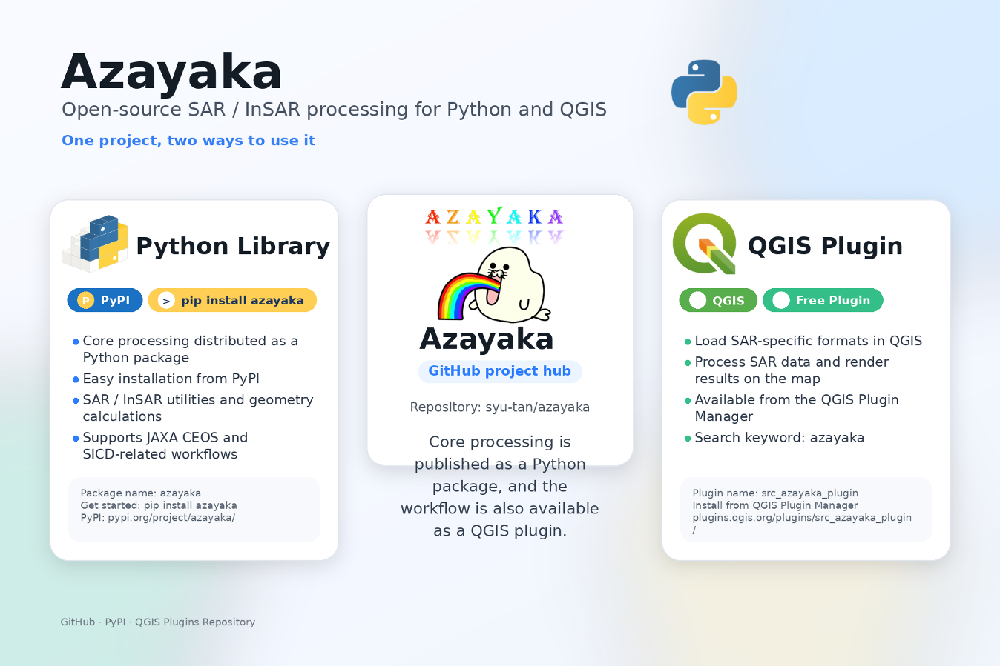

[English](./README.md)/[日本語](./README_JP.md)


**Azayaka** is a project that provides free tools for processing Synthetic Aperture Radar (SAR) data.

The main goals of the Azayaka members are learning and personal interest.

In addition, formulas and diagrams are stored together with the project.

# Azayaka Project



The Azayaka project provides two components.
1. `Python library`
2. `QGIS plugin`

## 1. Python Library

The Python implementation includes the core processing and formulas for SAR/InSAR.

You can download and install it via [the Python package manager PyPI](https://pypi.org/project/azayaka/).


## 2. QGIS Plugin

On QGIS, it provides a UI that passes processing to the Python library.
This allows you to go from SAR/InSAR processing to visualization through operations in the QGIS interface.

It can also be searched, downloaded, and installed from the [QGIS Plugin Manager](https://plugins.qgis.org/plugins/src_azayaka_plugin/).


# Installation

## 1. Python Library

You can install it in one of the following two ways.

Automatic installation from PyPI **(recommended)**
```shell
pip install azayaka
```

Build from source code
```shell
git clone azayaka
cd azayaka
pip install -r requirements.txt
pip install -e .
```

## 2. QGIS Plugin

### Step 1

Set up the environment for the plugin.

In the QGIS plugin search screen, search for `QGIS Pip Manager` and click `Install`.

In the `search` section, select `azayaka` and click `Install/Upgrade`.

(If you are familiar with the QGIS Python path, you can also install it directly with `pip`.)

### Step 2

In the QGIS plugin search screen, search for `azayaka` and click `Install`.


## Requirements

- Python 3.9 or later
- The Python library has been lightly tested with Python 3.9 to 3.12.
- The QGIS plugin has been confirmed on Windows 11 and macOS 14.3.

# Usage

## Python Library

A tutorial notebook is available on [Colab](example/notebook/colab_geocode_alos2.ipynb).

Note: the free CPU runtime does not have enough memory, so select a TPU or high-memory runtime.

[](https://colab.research.google.com/github/syu-tan/azayaka/blob/main/example/notebook/colab_geocode_alos2.ipynb)


## QGIS Plugin

1. In QGIS, select "Plugins" → "Azayaka Plugin" from the menu.
2. In the dialog, select the processing tab you want to run (InSAR or Geocoding).
3. Set the required input parameters and click the OK button.
4. When processing is complete, the results are saved in the specified output directory.


*© JAXA* *© OpenStreetMap*


## Example on YouTube

Coming soon

# Documentation

## Python

[Python library documentation](https://syu-tan.github.io/azayaka/)

## Formulas and Figures


[Materials for formulas and figures (PDF)](doc/figure/002_SAR_equation-geometory-condition_jp.pdf)

Only the Japanese version is currently available. The English version will be published soon.

## Development Materials

- [PyPI](doc/pypi.md)
- [QGIS](doc/qgis_plugin.md)

# Related Materials

For the processing details and basics, the following book is used as a reference.

https://github.com/syu-tan/sar-python-book


# License

[GNU Affero General Public License v3.0](./LICENSE)
