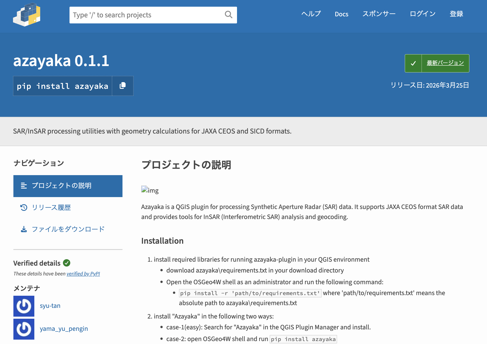
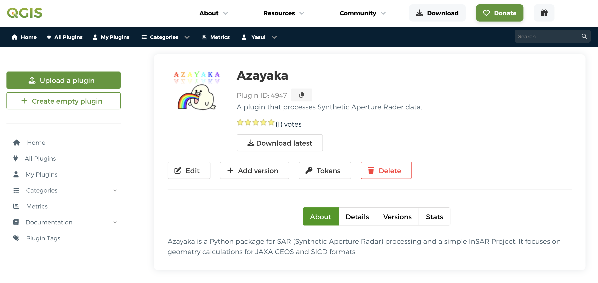
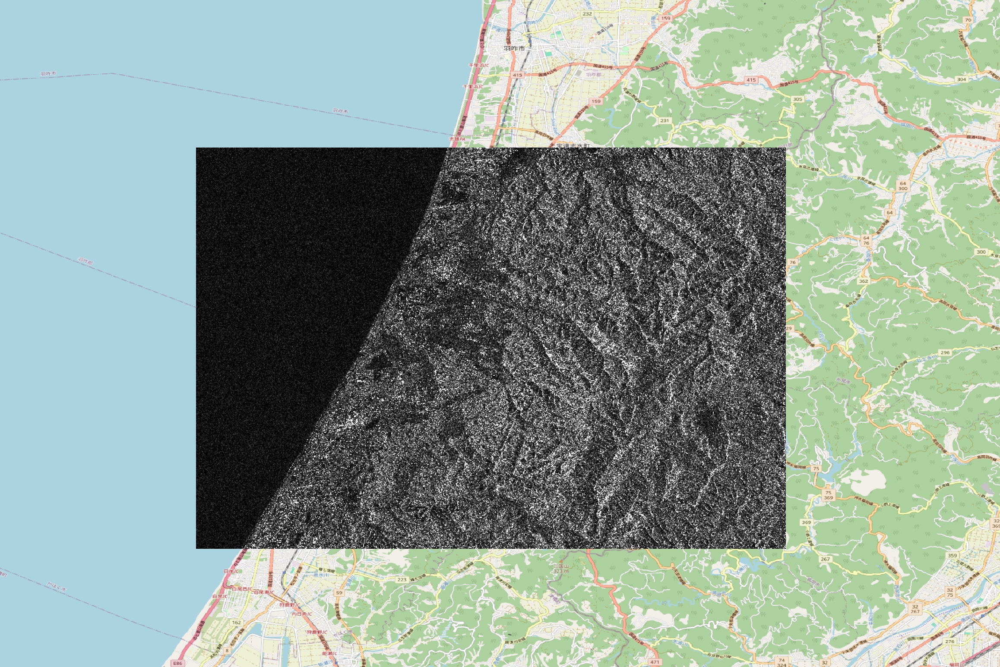
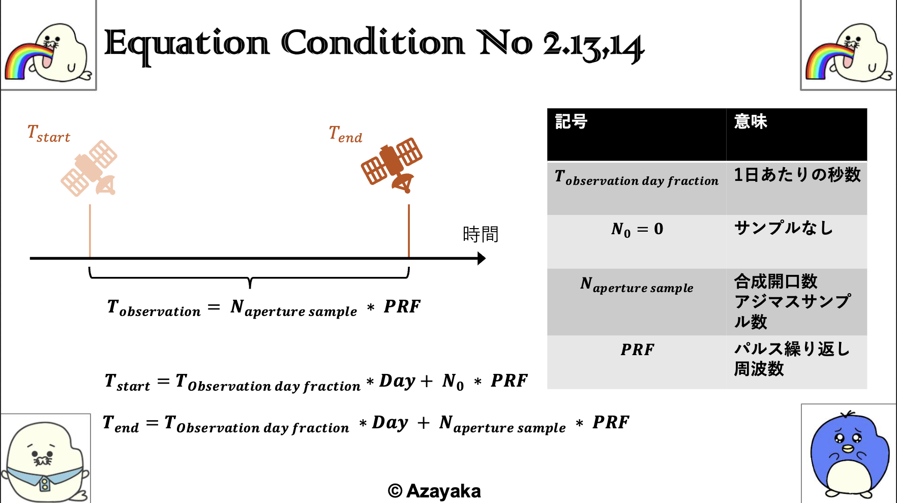

[English](./README.md)/[日本語](./README_JP.md)


**Azayaka** プロジェクトは は、Synthetic Aperture Radar（SAR）データを処理するためのツールを無料で提供します。

Azayaka のメンバーの主な目的は、勉強のためと趣味です。

さらに、数式や図版についても一緒に保管されています。

# Azayaka プロジェクト


Azayaka プロジェクトは、２つの機能を提供しています。
1. `Python ライブラリ`
2. `QGIS プラグイン`

## 1. Python ライブラリ

Pythonの実装では、SAR/InSARの核心となる処理や数式を実装しています。

[Python パッケージマネージャー PyPI](https://pypi.org/project/azayaka/) を介して、ダウンロード・インストールできます。




## 2. QGIS プラグイン

QGIS上で、Pythonライブラリに処理を伝えるUIを提供します。
QGISの画面上の操作で、SAR/InSARから描画まで可能になります。

また、[QGISプラグインマネージャー](https://plugins.qgis.org/plugins/src_azayaka_plugin/)から検索してダウンロード・インストールすることが可能です。



# インストール方法

## 1. Python ライブラリ

以下の２種類の方法でインストールすることができます。

PyPI での自動インストールする場合 **(推奨)**
```shell
pip install azayaka
```

ソースコードからビルドする場合
```shell
git clone azayaka
cd azayaka
pip install -r requirements.txt
pip install -e .
```

## 2. QGIS プラグイン

### Step 1

プラグインのための環境構築を行います。

QGIS のプラグイン検索画面で、`QGIS Pip Manager` を検索して、`インストール` を押下する。

`search` の項目で `azayaka` を選択して、`Install/Upgrade` を押下する。

(もし、QGISのPythonパスに詳しいのであれば、直接pipでインストールしてもらっても構いません。)

### Step 2

QGIS のプラグイン検索画面で、`azayaka` を検索して、`インストール` を押下する。


## 動作要件

- Python 3.9 以上
- Pythonライブラリは、Python 3.9 ~ 3.12 で簡単な試験がされています。
- QGISプラグインは、Windows11 と MacOS 14.3 で確認済みです。

# 使い方

## Python ライブラリ

[Colabでのチュートリアルノートブック](example/notebook/colab_geocode_alos2.ipynb)です。

注意点として、無料の CPU ランタイムではメモリが足りないので TPU やはいメモリのランタイムを選択すること

[](https://colab.research.google.com/github/syu-tan/azayaka/blob/main/example/notebook/colab_geocode_alos2.ipynb)


## QGIS プラグイン

1. QGIS でメニューから「Plugins」→「Azayaka Plugin」を選択します。
2. ダイアログで、実行したい処理タブ（InSAR または Geocoding）を選択します。
3. 必要な入力パラメータを設定し、OK ボタンをクリックします。
4. 処理が完了すると、結果は指定した出力ディレクトリに保存されます。


*© JAXA* *© OpenStreetMap*


## YouTube での使用例

近日公開予定

# ドキュメント

## Python

[Python ライブラリのドキュメント](https://syu-tan.github.io/azayaka/)

## 数式と図版



[数式と図版の資料(PDF)](doc/figure/002_SAR_equation-geometory-condition_jp.pdf)

日本語版のみを現在は、公開中で英語版は近日公開します。

## 開発向け資料

- [PyPI](doc/pypi.md)
- [QGIS](doc/qgis_plugin.md)

# 関連資料

処理の内容や基本に関しては、以下の書籍を参考にしてます。

https://github.com/syu-tan/sar-python-book


# ライセンス

[GNU Affero General Public License v3.0](./LICENSE)


