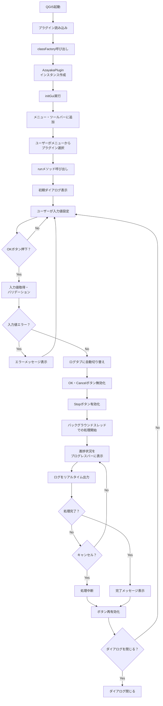

# QGISプラグインのファイル構成と説明

## プラグインの概要

- **InSAR処理**: 干渉SAR処理
- **ジオコーディング処理**: SARデータを地理座標系に投影

## ファイル構成

```
src_qgis_plugin/
├── __init__.py                          # プラグインのエントリーポイント
├── azayaka_plugin.py                    # プラグインのメインロジック
├── azayaka_plugin_dialog.py             # ダイアログのロジック
├── azayaka_plugin_dialog_base.ui        # ダイアログのUI定義ファイル
├── metadata.txt                         # プラグインのメタデータ
├── icon.png                             # プラグインのアイコン
├── resources.qrc                        # Qtリソースファイル
├── resources.py                         # コンパイル済みリソースファイル
└── README.md                            # プラグインの説明とセットアップ手順
```

## 各ファイルの詳細説明

### `__init__.py`

**役割**: QGISプラグインのエントリーポイント。QGISがプラグインを読み込む際に最初に呼び出すファイル。

**主な機能**:
- `classFactory()`関数を定義し、QGISインターフェース（`iface`）を受け取る
- プラグインのメインクラス（`AzayakaPlugin`）をインポートしてインスタンス化
- QGISがプラグインを認識し、起動するための橋渡し役

**実装のポイント**:
```python
def classFactory(iface):
    from .azayaka_plugin import AzayakaPlugin
    return AzayakaPlugin(iface)
```

この関数はQGISから必須で呼び出されるため、実装必須。

### `azayaka_plugin.py`

**役割**: プラグインのメインロジックを実装するファイル。QGISとの連携処理、メニュー・ツールバーへの追加、バックグラウンド処理の管理などを司る、いわばコントローラー。

**主なクラスと機能**:

#### `AzayakaPlugin`クラス

QGISプラグインのメインクラス。以下のメソッドを実装。

- **`__init__(self, iface)`**: コンストラクタ
  - QGISインターフェースへの参照を保存
  - ロガーの初期化
  - `sys.stdout`の修正（QGIS環境でのtqdm対応）

- **`initGui(self)`**: プラグイン読み込み時に呼び出される
  - メニューやツールバーにプラグインのアクション追加
  - アイコンとメニュー項目の設定

- **`unload(self)`**: プラグイン無効化時に呼び出される
  - メニューやツールバーからプラグインのアクション削除

- **`run(self)`**: プラグイン実行時のメイン処理
  - ダイアログの表示と初期化
  - ログハンドラーの設定
  - ボタンイベントの接続

#### `QtLogHandler`クラス

カスタムログハンドラー。ログメッセージをQTextEditウィジェットに出力する。

- `log_signal`: PyQtのシグナルでスレッドセーフにログを出力
- キャンセルメッセージを赤色表示可能

#### `InterferometryWorker`クラス

InSAR処理をバックグラウンドスレッドで実行するワーカークラス。

- `QThread`を継承し、重い処理をUIをブロックせずに実行
- 進捗状況、ログメッセージ、エラーをシグナルで通知
- キャンセル機能を実装

#### `GeocodeWorker`クラス

ジオコーディング処理をバックグラウンドスレッドで実行するワーカークラス。

- `InterferometryWorker`と同様の構造
- SARデータのジオコーディング処理を実行

**実装のポイント**:
- UIをブロックしないよう、重い処理は`QThread`でバックグラウンド実行
- 進捗状況をプログレスバーで表示
- エラーハンドリングとログ出力を適切に実装

### `azayaka_plugin_dialog.py`

**役割**: プラグインのダイアログ（GUI）に関するロジックを実装するファイル。UI上のイベント処理やユーザー操作への応答を記述。

**主なクラス**:

#### `AzayakaPluginDialog`クラス

プラグインのメインダイアログクラス。`QtWidgets.QDialog`とUIファイルから生成された`FORM_CLASS`を継承。

**主なメソッド**:

- **`__init__(self, parent=None)`**: コンストラクタ
  - UIの初期化
  - プログレスバー、ログ表示エリアの初期化
  - キャンセルボタンのイベント接続

- **`accept(self)`**: OKボタン押下時の処理
  - ログタブへの切り替え
  - 処理中フラグ設定
  - ボタンの無効化

- **`clear_log(self)`**: ログ表示エリアをクリア

- **`processing_completed(self)`**: 処理完了時の処理
  - ボタンの再有効化
  - 処理フラグのリセット

- **`get_insar_inputs(self)`**: InSARタブの入力値を取得
  - 前イベントディレクトリ、後イベントディレクトリ、出力ディレクトリ、DEMパスを取得

- **`get_geocoding_inputs(self)`**: ジオコーディングタブの入力値を取得
  - 処理開始レベル、SARディレクトリ、DEMパス、出力ディレクトリを取得

- **`get_current_tab_index(self)`**: 現在選択タブのインデックスを取得

- **`_on_cancel_clicked(self)`**: キャンセルボタン押下時の処理

**実装のポイント**:
- UIファイル（`.ui`）から生成されたクラスを継承して使用
- タブウィジェットで複数処理を1つのダイアログで管理
- 入力値の取得とバリデーション

### `azayaka_plugin_dialog_base.ui`

**役割**: プラグインのGUIデザインを定義したXML形式ファイル。Qt Designerで編集可能。

**主な要素**:
- タブウィジェット: InSAR処理タブ、ジオコーディング処理タブ、ログ表示タブ
- ファイル選択ウィジェット: ディレクトリやファイル選択
- プログレスバー: 処理進捗を表示
- ログ表示エリア: 処理ログを表示
- ボタン: OK、キャンセル、停止ボタン

**編集方法**:
- QGIS付属のQt Designerで編集
- ウィジェット追加・配置・プロパティ設定ができる
- 編集後、`.ui`ファイルを保存するだけで反映

### `metadata.txt`

**役割**: プラグインのメタデータを記述するファイル。プラグインマネージャーへ情報を表示する元データ。

**主な項目**:

- **必須項目**:
  - `name`: プラグイン名
  - `qgisMinimumVersion`: 動作最小QGISバージョン
  - `description`: プラグインの説明
  - `about`: 詳細な説明
  - `version`: バージョン番号
  - `author`: 作者名
  - `email`: メールアドレス
  - `repository`: リポジトリURL

- **推奨項目**:
  - `icon`: アイコンファイル名
  - `tags`: タグ（カンマ区切り）
  - `category`: カテゴリ（Raster, Vector, Database, Web, Plugins）
  - `experimental`: 実験的プラグインかどうか
  - `deprecated`: 非推奨かどうか

**注意事項**:
- エンコーディングはUTF-8で記述
- 公式リポジトリへアップロードする場合は追加検証ルールに従う必要あり

### `icon.png`

**役割**: プラグインのアイコン画像ファイル。プラグインマネージャーやメニューに表示。

**形式**: PNG、JPEGなどのWeb対応フォーマット

**使用方法**:
- `metadata.txt`の`icon`項目で指定
- `resources.qrc`に登録してリソースとして使用

### `resources.qrc`

**役割**: Qtリソースファイル。プラグインで使うアイコンや画像などのリソースを定義。

**内容**:
```xml
<RCC>
    <qresource prefix="/plugins/azayaka_plugin" >
        <file>icon.png</file>
    </qresource>
</RCC>
```

**例：画像変更時のコンパイル方法**:

1. OSgeo4W shellを開き、アイコン画像を配置したローカルのdirまで移動
```
cd 'path/to/azayaka_plugin'
```

※windowsではicon.pngは C:\Users\hogehoge\AppData\Roaming\QGIS\QGIS3\profiles\default\python\plugins\azayaka_plugin 配下に存在

2. その後以下のコマンドを実行（コンパイル）し、リロード
```
pyrcc5 -o resources.py resources.qrc
```
※リロード：Plugin ReloaderというQGISプラグインを使用するとソース更新時に毎回QGISを再起動しなくて良いため便利

**注意事項**:
- 他のプラグインやQGISのリソースと衝突しないよう、適切なプレフィックス（`/plugins/azayaka_plugin`）を使用
- リソース追加・変更時は`pyrcc5`コマンドで再コンパイルが必要

### `resources.py`

**役割**: `resources.qrc`をコンパイルして生成されるPythonファイル。リソースファイルをPythonコードから利用できるようにする。

**生成方法**:
- `pyrcc5`コマンドにより`resources.qrc`から自動生成
- 手動編集は不要

**使用方法**:
- `azayaka_plugin.py`で`from .resources import *`でインポート
- アイコンパスは`:/plugins/azayaka_plugin/icon.png`形式で記述

### `README.md`

**役割**: プラグインの説明とセットアップ手順などを記述するファイル。

**主な内容**:
- プラグイン実行に必要なライブラリのインストール方法
- 開発環境での動作確認方法

## プラグインの動作フロー

### フローチャート



### 詳細説明

1. **プラグイン読み込み時**:
   - QGISが`__init__.py`の`classFactory()`を呼び出し
   - `AzayakaPlugin`クラスのインスタンス作成
   - `initGui()`が呼び出され、メニュー・ツールバーにプラグインを追加

2. **プラグイン実行時**:
   - ユーザーがメニューからプラグインを選択
   - `run()`メソッドが呼び出されダイアログを表示
   - ユーザーが入力値を設定し、OKボタンをクリックすることで実行

3. **処理実行時**:
   - ログタブへ自動で切り替え
   - `InterferometryWorker`または`GeocodeWorker`がバックグラウンドスレッドで起動
        - 同一スレッドのままではバックエンドで処理進行中にも関わらずUIは固まってしまう
        - ユーザーに進行具合を示したりstopボタンを押下できるようにするためにマルチスレッドの使用を採用
   - 進捗状況がプログレスバーに表示
   - ログがリアルタイムで表示エリアへ出力

4. **処理完了時**:
   - 完了メッセージを表示
   - ボタンが再有効化され再度処理可能

5. **プラグイン無効化時**:
   - `unload()`呼び出しでメニュー・ツールバーから削除

## 開発tips

### プラグイン実行に必要なライブラリをQGIS環境にインストールする方法

- OSgeo4W shellを管理者権限で開き、以下のコマンドを実行
```
pip install -r 'path/to/requirements.txt'
```
※'path/to/requirements.txt'：ローカルのazayaka\requirements.txtへの絶対パス

### 開発側でのQGISの動作確認

開発中に毎回pip installするのが手間な場合、ファイルを手動で配置する事も可能

- 1. azayakaのsrcファイル(pip installの対象ファイル群)を以下に配置
    - C:\Users\hogehoge\AppData\Roaming\Python\Python312\site-packages\azayaka

- 2. azayaka\src_qgis_plugin配下のファイルを以下に配置
    - C:\Users\hogehoge\AppData\Roaming\QGIS\QGIS3\profiles\default\python\plugins\azayaka_plugin

- 3. プラグインのリロード
    QGISのプラグイン'Plugin Reloader'を使用するとQGISを再起動しなくて良いため、効率的

## 参考資料

- [QGIS公式ドキュメント - Pythonプラグインを構成する](https://docs.qgis.org/3.28/ja/docs/pyqgis_developer_cookbook/plugins/plugins.html)
- [QGISのプラグインの実装例 - nujust's blog](https://nujust.hatenablog.com/entry/2023/06/10/101433)
- [QGISプラグインをつくってみよう - エアロトヨタ](https://www.aerotoyota.co.jp/fun/column/52/)
- [PyQtで重い処理をする時に使うべきマルチスレッドとプログレスバーの実装](https://qiita.com/phyblas/items/37ef1b77decbc48c5fa5#%E3%83%97%E3%83%AD%E3%82%B0%E3%83%AC%E3%82%B9%E3%83%90%E3%83%BC)